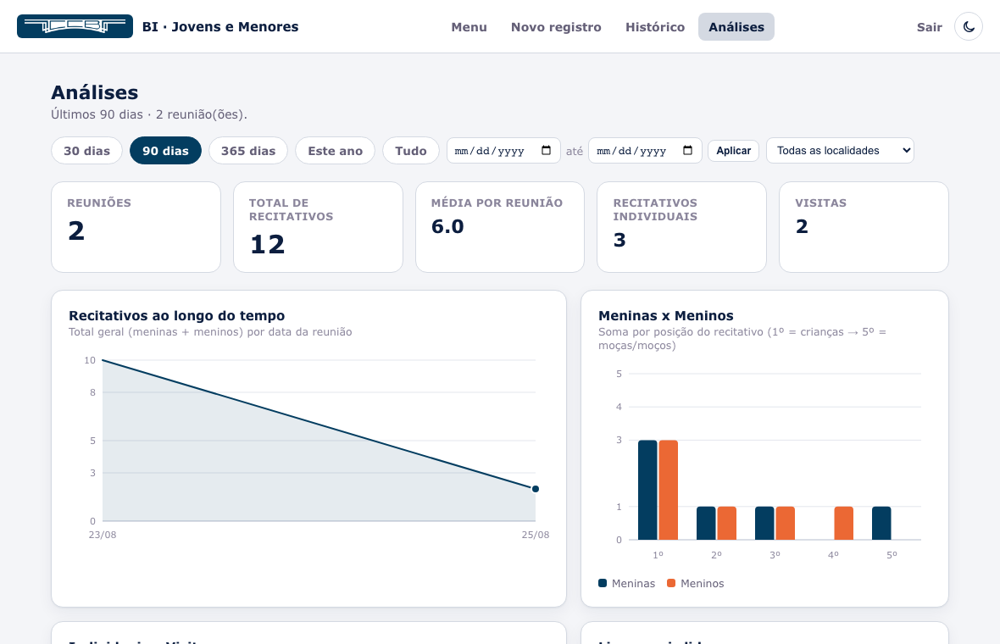
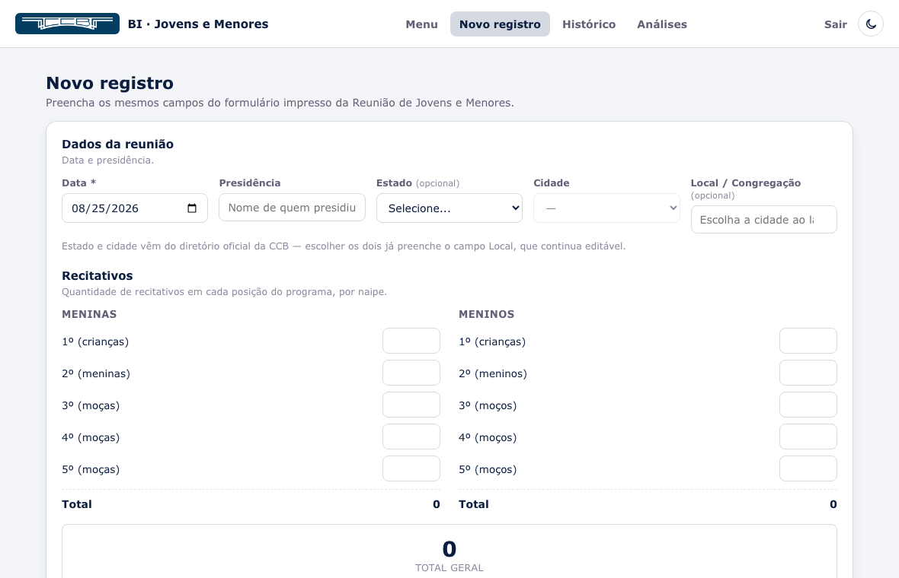

# BI · Reunião de Jovens e Menores

Aplicativo local (Flask + SQLite) para registrar e analisar os formulários da
**Reunião de Jovens e Menores** da Congregação Cristã no Brasil. Roda no
computador da igreja — sem instalar servidor, sem internet no dia a dia — e
fica disponível para qualquer celular/tablet conectado na mesma rede Wi-Fi
através de um link (e um QR code).



## Funcionalidades

- **Formulário digital** que espelha o impresso: recitativos por naipe e
  posição, recitativos individuais, visitas e a seção "Palavra".
- **Validação bíblica de verdade**: Livro, Capítulo e Versículo são selects
  em cascata que só permitem combinações que existem na Bíblia (dados de
  versificação embutidos, veja `src/models/biblia.py`).
- **Localidade oficial da CCB**: os campos Estado/Cidade vêm do diretório
  público da CCB (`src/static/dados/localidades_ccb.json`, baixado uma única
  vez do site oficial) — funciona 100% offline depois de instalado. Tem
  também uma busca ao vivo (`/api/localidade-busca`) pra achar a unidade
  específica pelo nome — essa parte precisa de internet; sem ela, o campo
  Local continua editável à mão.
- **Rascunho automático**: o formulário salva o preenchimento sozinho neste
  aparelho (`localStorage`), então dá pra sair no meio do culto sem perder
  nada.
- **Dois níveis de acesso** (login simples, duas senhas compartilhadas):
  Cooperador de Jovens (acesso completo) e Irmãos da Contagem (só
  registro/edição, sem excluir e sem ver as Análises).
- **Painel de Análises**: KPIs e gráficos (SVG, sem biblioteca externa) com
  filtro por período, presidência e localidade.
- **Acesso pela rede local**: link + QR code exibidos no menu — qualquer
  aparelho no mesmo Wi‑Fi acessa sem instalar nada.



## Como usar (igreja / usuário final)

Instruções em português, passo a passo, para quem só quer rodar o programa
(não precisa saber programar).

### O que é

Um site que roda no próprio computador da igreja (não precisa de internet
depois de configurado) para:

1. Cadastrar os formulários da Reunião de Jovens e Menores
2. Ver o histórico e editar/excluir registros
3. Acompanhar análises (gráficos) sobre os dados

Qualquer celular, tablet ou notebook conectado no MESMO Wi-Fi do computador
da igreja consegue acessar pelo link que aparece na tela inicial (ou lendo o
QR code).

### Configuração inicial (só da primeira vez)

1. Copie a pasta inteira do projeto para o computador da igreja (pen drive,
   e-mail, OneDrive, etc. — copie a pasta toda).
2. Instale o [Python 3](https://www.python.org/downloads/) gratuito (só
   precisa fazer isso uma vez).
   - No Windows: durante a instalação, marque a caixinha "Add python.exe to
     PATH" antes de clicar em Instalar.
   - No Mac: pode baixar o instalador do site acima, ou já vem pronto em
     Macs mais novos.
3. Dê dois cliques no arquivo `Iniciar_Windows.bat` (Windows) ou
   `Iniciar_Mac.command` (Mac). Na primeira vez ele vai demorar um pouco
   (baixa e prepara os componentes — precisa de internet só nesse momento).
   Da segunda vez em diante abre em segundos e funciona mesmo sem internet.
   - Mac: se aparecer aviso de segurança ("não é possível abrir"), clique
     com o botão direito no arquivo → Abrir → Abrir.

### Uso no dia a dia

Depois de configurado, é só dar **dois cliques** no arquivo certo:

- Windows → `Iniciar_Windows.bat`
- Mac → `Iniciar_Mac.command`

Uma janela preta (terminal) vai abrir e mostrar dois endereços, por exemplo:

```
Neste computador .... http://127.0.0.1:8000
Na rede local ........ http://192.168.0.15:8000
```

O navegador abre sozinho neste computador. Para as OUTRAS pessoas acessarem
pelo celular, é só abrir o link "Na rede local" (ou usar o QR code que
aparece no Menu) estando no mesmo Wi-Fi.

NÃO FECHE essa janela preta enquanto estiver usando o sistema — ela é o
"motor" que mantém o site no ar. Para encerrar, feche a janela ou pressione
CTRL+C dentro dela.

### Login — duas senhas

Ao abrir o link, primeiro aparece uma tela de Entrar com duas opções. Não
são contas pessoais, são duas senhas compartilhadas mesmo:

- **Cooperador de Jovens** — acesso completo: novo registro, histórico
  (editar E excluir) e a tela de Análises.
- **Irmãos da Contagem** — para o dia a dia do culto: novo registro e
  histórico (só editar). Não vê a tela de Análises e não pode excluir
  registros.

**Importante**: as senhas vêm de fábrica com um valor de exemplo bem óbvio
(`troque-esta-senha-1` / `troque-esta-senha-2`) — troque as duas ANTES de
usar de verdade, em [`src/config_acesso.py`](src/config_acesso.py) (abra em
qualquer editor de texto, mude o que está entre aspas e salve). Depois feche
a janela preta e abra o "Iniciar" de novo.

A sessão fica conectada por bastante tempo no mesmo aparelho/navegador (não
precisa digitar a senha toda hora) — use "Sair", no canto superior direito,
para desconectar.

### Onde ficam os dados

Tudo é salvo no arquivo `src/dados/ccb.db` — um banco de dados único
(SQLite). Para fazer backup, basta copiar esse arquivo para um pen drive ou
nuvem de vez em quando. Para "zerar" o sistema, apague esse arquivo (ele é
recriado vazio automaticamente na próxima vez que abrir).

### Páginas do sistema

- **Menu** — tela inicial, com o link/QR code de acesso pela rede
- **Novo registro** — formulário igual ao papel (recitativos, palavra, etc.)
- **Histórico** — lista todos os registros; editar (os dois papéis) e
  excluir (só Cooperador de Jovens)
- **Análises** — painel com gráficos e indicadores (só Cooperador de
  Jovens; filtro por período, presidência e localidade)

### Perguntas frequentes

**Preciso reinstalar tudo toda vez?**
Não. A instalação (passo 2 e a primeira execução do passo 3) só acontece uma
vez. Depois é sempre dois cliques.

**Funciona sem internet?**
Sim, depois da primeira configuração o sistema roda 100% local. Só precisa
que os aparelhos estejam no mesmo Wi-Fi/rede local (o roteador não precisa
ter internet).

**Posso usar em mais de um computador?**
Pode, mas cada computador terá seu PRÓPRIO banco de dados. O ideal é manter
um único computador como "servidor" (o da igreja) e todos os outros
aparelhos apenas acessam pelo link.

**Comecei a preencher e precisei sair no meio do culto, perdi tudo?**
Não. Enquanto você digita, o formulário vai salvando um rascunho sozinho
NESTE aparelho/navegador. Se sair e voltar depois (mesmo fechando a aba),
aparece um aviso oferecendo "Restaurar" o que já tinha sido preenchido.

**O link mudou / não abre no celular**
O endereço da rede local depende do IP do computador, que pode mudar se o
roteador reiniciar. Basta abrir o Menu no computador da igreja e copiar o
link/QR code atualizado.

## Desenvolvimento

```bash
python3 -m venv src/venv
source src/venv/bin/activate    # Windows: src\venv\Scripts\activate
pip install -r requirements.txt
cd src
python3 app.py                  # http://127.0.0.1:8000
```

**Stack**: Python 3 + Flask + SQLite (sem ORM), Jinja2, CSS/JS puros (sem
build step, sem framework de frontend), gráficos em SVG feitos à mão
(`src/static/js/charts.js`).

## Estrutura

Todo o código-fonte fica em `src/` — a raiz do repositório só tem
documentação, licença e os atalhos de "duplo clique". Dentro de `src/`, o
código é organizado em MVC: **models** (dados/regras), **views**
(`templates/`, o padrão do próprio Flask/Jinja2) e **controllers** (rotas),
com uma camada extra de **services** para integrações e regras que não são
nem "model" nem "controller" puro — cada módulo com uma responsabilidade só.

```
readme.md, LICENSE, requirements.txt        documentação e metadados
Iniciar_Windows.bat / Iniciar_Mac.command   atalhos de "duplo clique"

src/
  app.py                         cria o Flask, registra os blueprints, sobe o servidor
  config.py                      constantes do app (porta, papéis de login, localidade padrão)
  config_acesso.py               as duas senhas de acesso

  models/                        camada M — dados e regras, sem saber nada de Flask/HTTP
    database.py                    schema do SQLite, conexão por requisição, helpers de linha
    biblia.py                      estrutura da Bíblia (capítulos/versículos) + validação

  services/                      integrações e listas derivadas do banco
    localidades_ccb.py             diretório oficial da CCB (estados/cidades + busca ao vivo)
    sugestoes.py                   localidades/visitas/nomes já usados (autocomplete)

  controllers/                   camada C — um Blueprint por área
    auth.py                         login/logout + decorators de acesso
    menu.py                         menu e QR code do link de rede
    localidade_api.py               busca ao vivo de unidades (JSON)
    registros.py                    novo/editar/excluir registro + histórico
    dashboard.py                    painel de Análises (KPIs e gráficos)

  utils/                         infraestrutura sem regra de negócio
    rede.py                         IP na rede local, abrir navegador
    seguranca.py                    chave de sessão (gerada uma vez por instalação)
    formatacao.py                   datas em formato brasileiro

  templates/                     camada V — páginas (Jinja2)
  static/
    css/style.css                 tema, paleta, tipografia
    js/charts.js                  gráficos SVG (linha/barra/pirâmide/heatmap) sem dependências
    js/form.js                    cascatas do formulário + rascunho automático
    js/main.js                    utilidades pequenas (copiar link, confirmar exclusão)
    img/                           logo e favicon oficiais da CCB
    dados/localidades_ccb.json    estados/cidades (diretório oficial CCB)
  dados/                          banco SQLite + chave de sessão (não versionados)
  docs/                           capturas de tela deste readme
```

## Licença

Código sob [MIT](LICENSE).

**Marcas**: "Congregação Cristã no Brasil", a sigla "CCB" e o emblema
institucional são marcas da Congregação Cristã no Brasil e **não** estão
cobertas pela licença MIT. Este é um projeto **não-oficial**, construído por
um membro/colaborador para uso interno de uma congregação local — sem
vínculo com a administração nacional da CCB. Se for adaptar este projeto
para outro fim que não seja uso interno de uma congregação da CCB, troque o
nome, as cores e os arquivos em `src/static/img/` pela sua própria
identidade.
